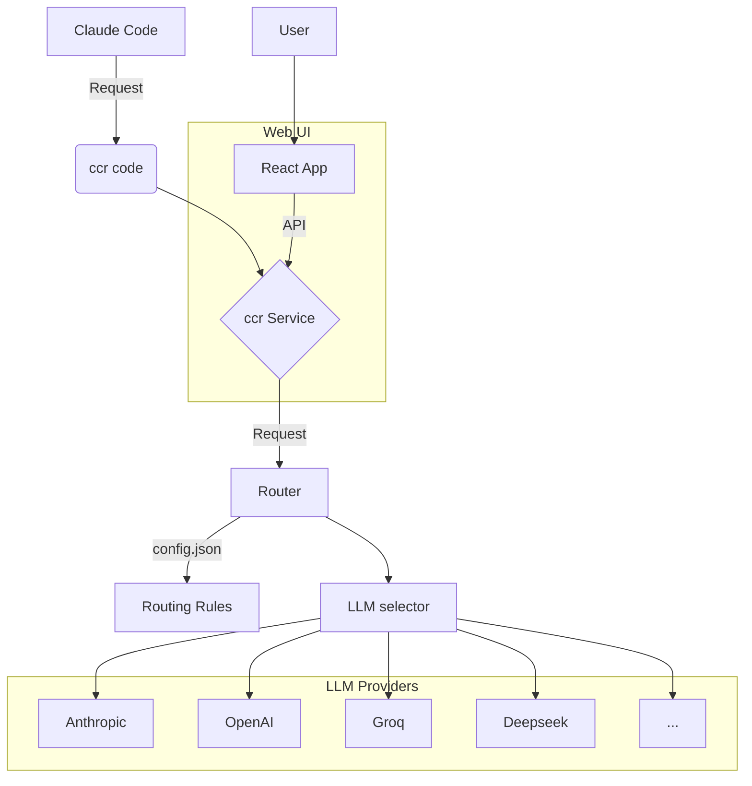
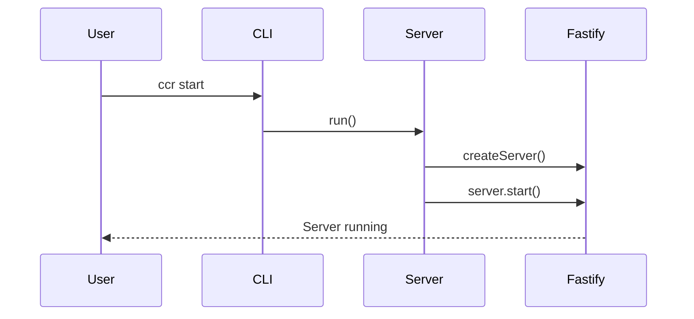
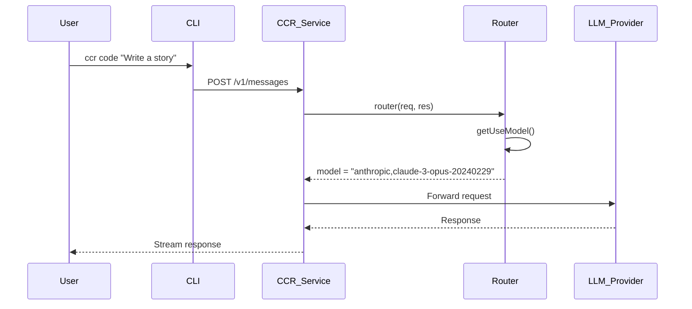

## Design and Architecture

The `claude-code-router` is a sophisticated tool that intercepts requests from Claude Code and routes them to various Large Language Models (LLMs) based on a flexible and powerful configuration. This allows developers to use the best model for a specific task, optimize costs, and experiment with different providers without changing their workflow.

### Core Components

| Component | File(s) | Description |
| :--- | :--- | :--- |
| **CLI** | `src/cli.ts` | The main entry point for the application. It parses command-line arguments and executes the corresponding actions, such as starting or stopping the server. |
| **Server** | `src/index.ts`, `src/server.ts` | The core of the router. It's a Fastify server that listens for requests from a custom Claude Code client. It handles authentication, routing, and serving the web UI. |
| **Router** | `src/utils/router.ts` | The brain of the application. It contains the logic for selecting the appropriate LLM provider and model based on the request's properties and the user's configuration. |
| **Configuration** | `~/.claude-code-router/config.json` | A JSON file where users define their LLM providers, routing rules, and other settings. |
| **Web UI** | `ui/` | A React-based single-page application that provides a user-friendly interface for managing the router's configuration. |

### Architectural Diagram



## How to use the codebase effectively

### Getting Started

1.  **Installation**:
    ```bash
    npm install -g claude-code-router
    ```

2.  **Configuration**:
    The first time you run `ccr`, it will create a `~/.claude-code-router/config.json` file. You need to edit this file to add your LLM providers. Here's a minimal example:
    ```json
    {
      "PORT": 3456,
      "APIKEY": "your-secret-apikey",
      "Providers": [
        {
          "name": "anthropic",
          "apiKey": "your-anthropic-api-key"
        }
      ],
      "Router": {
        "default": "anthropic,claude-3-opus-20240229"
      }
    }
    ```

3.  **Start the server**:
    ```bash
    ccr start
    ```

4.  **Use with Claude Code**:
    To route your Claude Code requests through the router, you need to configure the Claude Code client to use the router's endpoint. This is typically done by setting the `CLAUDE_CODE_API_ENDPOINT` environment variable:
    ```bash
    export CLAUDE_CODE_API_ENDPOINT="http://localhost:3456"
    ```
    Now, when you use Claude Code, your requests will be sent to the router.

### Web UI

The web UI provides a convenient way to manage your configuration. To open it, run:

```bash
ccr ui
```

This will open a web page in your browser where you can:

*   Add, edit, and remove LLM providers.
*   Configure routing rules.
*   View logs.
*   Restart the server.

## Complete call stack and execution flow

### `ccr start`



### `ccr code "..."`



## Effects of changing each configuration or parameter

### `~/.claude-code-router/config.json`

| Parameter | Type | Description | Effects of Changing |
| :--- | :--- | :--- | :--- |
| `PORT` | `number` | The port the router server will listen on. | You'll need to update `CLAUDE_CODE_API_ENDPOINT` to match the new port. |
| `APIKEY` | `string` | A secret key to protect your router from unauthorized access. | If set, all requests to the router must include an `x-api-key` header with this value. |
| `Providers` | `array` | An array of LLM provider configurations. | Adding or removing providers will change the available models for routing. |
| `Router` | `object` | Defines the routing rules. | This is where you can customize which model is used for different scenarios. |
| `CUSTOM_ROUTER_PATH` | `string` | Path to a custom JavaScript file for advanced routing logic. | If you need more complex routing than the default rules allow, you can provide a path to a JS file that exports a routing function. |

### `Router` Object

The `Router` object is the most powerful part of the configuration. Here are the default routing rules:

| Rule | Description | Example |
| :--- | :--- | :--- |
| `default` | The model to use for all requests that don't match any other rule. | `"anthropic,claude-3-opus-20240229"` |
| `longContext` | The model to use when the input token count exceeds `longContextThreshold`. | `"anthropic,claude-3-sonnet-20240229"` |
| `longContextThreshold` | The token count that triggers the `longContext` model. | `60000` |
| `background` | The model to use for requests that are identified as background tasks (e.g., generating code from a prompt). | `"groq,gemma-7b-it"` |
| `think` | The model to use when the request is for "thinking" or planning. | `"groq,llama3-8b-8192"` |
| `webSearch` | The model to use when the request involves a web search. | `"openai,gpt-4-turbo"` |

By customizing these rules, you can fine-tune the router's behavior to fit your exact needs. For example, you could use a fast, cheap model for simple tasks and a powerful, expensive model for complex reasoning.
